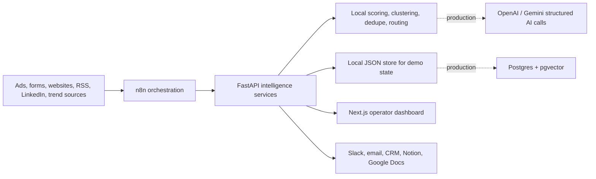

# AI Marketing Automation Systems

This submission explores all three Funnel Truffle automation problems as small, working system prototypes. The goal is not to present a perfect production app; it is to show how I think about marketing operations as systems: ingestion, validation, enrichment, AI-assisted reasoning, routing, human review, and measurable business outcomes.

Instead of only wiring tasks together in n8n, I built local intelligence services around the workflows. n8n acts as the orchestration layer, while the FastAPI backend handles scoring, classification, deduplication, prioritization, and explainable output. The Next.js dashboard is the operator surface for reviewing what the automations did and why.

## Deliverable Map

| Assignment Requirement | Included Here |
| --- | --- |
| Exported n8n workflow JSON | [`workflows/`](./workflows) |
| Screenshots of successful runs | [`screenshots/`](./screenshots) |
| Loom walkthrough structure | [`docs/loom-walkthrough.md`](./docs/loom-walkthrough.md) |
| Production breakage and next steps | Each problem doc plus [`docs/production-limitations.md`](./docs/production-limitations.md) |
| Pricing breakdown | [`docs/cost-breakdown.md`](./docs/cost-breakdown.md) |
| Curiosity question | [`docs/curiosity-question.md`](./docs/curiosity-question.md) |
| Submission email | [`docs/email-template.md`](./docs/email-template.md) |

## Systems Built

### Problem A: Real Estate Lead Qualification

Captures real estate leads from Meta Ads, Google Ads, website forms, WhatsApp, or CSV imports; validates contact quality; enriches intent from budget, location, email domain, and message text; scores each lead from 0 to 10; matches properties; and routes hot leads to sales while sending lower-confidence leads to review or nurture.

- Backend: `POST /api/leads`, `POST /api/leads/analyze`, `GET /api/leads`, `GET /api/leads/analytics`
- Workflow: [`workflows/problem-a-real-estate-lead-qualification.json`](./workflows/problem-a-real-estate-lead-qualification.json)
- Details: [`docs/problem-a-real-estate-lead-qualification.md`](./docs/problem-a-real-estate-lead-qualification.md)

### Problem B: Competitor Content Monitoring

Monitors competitor updates from blogs, LinkedIn, pricing pages, case studies, changelogs, jobs pages, GitHub, YouTube, and other sources; deduplicates repeated content; summarizes updates; detects strategic signals; scores priority; and produces a daily executive digest for Slack or email.

- Backend: `POST /api/content`, `POST /api/content/analyze`, `GET /api/content`, `GET /api/digest`, `GET /api/analytics`
- Dashboard: current Next.js home screen
- Workflow: [`workflows/problem-b-competitor-content-monitoring.json`](./workflows/problem-b-competitor-content-monitoring.json)
- Details: [`docs/problem-b-competitor-content-monitoring.md`](./docs/problem-b-competitor-content-monitoring.md)

### Problem C: Newsletter Ideation Engine

Runs a Monday morning editorial pipeline that collects trend stories, filters and groups them into themes, scores relevance and novelty, generates five candidate newsletter angles, and drafts the opening 100 words of the strongest angle for Notion or Google Docs export.

- Backend: `POST /api/newsletter-plan`, `GET /api/newsletter-plan`, `POST /api/editorial/stories`
- Workflow: [`workflows/problem-c-newsletter-ideation-engine.json`](./workflows/problem-c-newsletter-ideation-engine.json)
- Details: [`docs/problem-c-newsletter-ideation-engine.md`](./docs/problem-c-newsletter-ideation-engine.md)

## Architecture



## Tech Stack

| Layer | Choice | Why |
| --- | --- | --- |
| Orchestration | n8n | Easy webhook/schedule/API/email/Slack wiring with exported JSON workflows |
| Backend | FastAPI + Pydantic | Clear typed API contracts for automation payloads |
| Intelligence | Local deterministic rules now; LLM-ready structured outputs later | Keeps the demo reproducible while showing where AI fits |
| Frontend | Next.js + Tailwind + Recharts + lucide-react | Fast dashboard surface for reviewing operational intelligence |
| Storage | Local JSON for demo; Postgres/pgvector proposed for production | Simple local review, realistic production path |
| Testing | pytest + Next build | Verifies scoring, dedupe, digesting, and newsletter planning behavior |

## Run Locally

Backend:

```bash
cd backend
python3 -m venv .venv
source .venv/bin/activate
pip install -r requirements.txt
uvicorn app.main:app --reload --port 8001
```

Frontend:

```bash
npm install
NEXT_PUBLIC_API_BASE_URL=http://127.0.0.1:8001 npm run dev
```

Open the local URL printed by Next.js.

## Verification

```bash
PYTHONPATH=backend backend/.venv/bin/pytest backend/tests
npm run build
```

## Important Honesty Notes

- The system uses deterministic local reasoning so the reviewer can run it without paid AI keys.
- n8n workflow exports are provided as implementation blueprints with realistic node ordering and payload shapes.
- Live LinkedIn scraping, CRM writes, Slack posting, Notion export, Google Docs export, and paid enrichment providers are integration surfaces unless credentials are configured.
- The current data store is local JSON under `backend/var`, which is ignored by git. Production should use Postgres plus a queue.

## Recommended Submission Package

Send these links in the email:

- Main landing document: this README or a Notion page copied from [`docs/notion-submission-outline.md`](./docs/notion-submission-outline.md)
- Technical repo: <https://github.com/kshlgrg/real-estate-lead-intelligence-os>
- Live demo: <https://marketing-automation-systems.vercel.app>
- Public backend health check: <https://marketing-automation-systems.vercel.app/_/backend/api/health>
- Demo video: Loom, following [`docs/loom-walkthrough.md`](./docs/loom-walkthrough.md)
- Screenshots: [`screenshots/`](./screenshots)
- n8n exports: [`workflows/`](./workflows)
