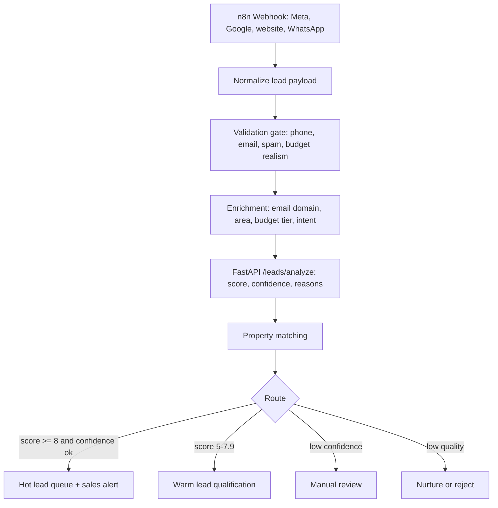

# Problem A: Real Estate Lead Qualification

## Problem Statement

A real estate developer gets about 200 leads per day from Meta Ads, Google Ads, and the website. Only about 15 percent are serious buyers. The automation captures incoming leads, enriches them with available signals, scores them from 1 to 10 using AI-assisted logic, routes hot leads to sales, and sends the rest into nurture or review.

## My Interpretation

The real business problem is not "send every lead to sales faster." That would make the sales team slower. The useful system should separate serious buying intent from noisy paid-lead volume, explain why a lead was routed a certain way, and keep enough audit data to improve future campaigns.

## Architecture



## Working Features

- Normalized lead schema for source, budget, location, property type, message, language, and timestamp.
- Validation for missing phone, disposable email, gibberish, suspicious IP, and unrealistic budget.
- Enrichment from email domain, budget band, and location category.
- Intent extraction for buyer type, purchase intent, luxury level, and timeline.
- 0 to 10 lead score with confidence and explainable reasons.
- Sales routing into hot, warm, nurture, manual review, or rejected.
- Property matching based on budget, location, type, and lifestyle terms.
- API analytics for funnel, spam rate, hot leads, source quality, and confidence.

## Tech Stack

| Layer | Tool |
| --- | --- |
| Orchestration | n8n |
| Backend | FastAPI |
| Validation and scoring | Python service layer |
| Data contracts | Pydantic |
| Storage | Local JSON for demo; Postgres in production |
| Alerts | Slack/Twilio/CRM integration surface |

## AI Pipeline

The local implementation uses deterministic scoring so reviewers can run it without API keys. In production, I would keep the deterministic gates and add a structured LLM call only after validation:

1. Extract buyer intent from message text.
2. Classify timeline and seriousness.
3. Detect mismatch between stated budget and desired property.
4. Return JSON with score, confidence, reasons, and uncertainty flags.

The important design choice is hybrid scoring: rules handle known hard constraints, while AI handles messy language.

## API Examples

Analyze a lead without storing it:

```bash
curl -X POST http://127.0.0.1:8001/api/leads/analyze \
  -H 'Content-Type: application/json' \
  -d '{
    "lead_id": "LD-9001",
    "name": "Rhea Mehta",
    "email": "rhea.mehta@meridianfin.com",
    "phone": "+919811112233",
    "budget": "2Cr",
    "preferred_location": "Gurugram Golf Course Extension",
    "property_type": "3BHK",
    "message": "Need a 3BHK for family, move in within 3 months. Prefer metro access and clubhouse.",
    "source": "google_ads",
    "timestamp": "2026-05-15T10:00:00+05:30",
    "language": "English",
    "ip_address": "103.45.22.18"
  }'
```

## Edge Cases

- Missing phone or disposable email should block paid sales routing.
- A luxury property request with a small budget should be downgraded or reviewed.
- Low-confidence leads should not be discarded automatically.
- Duplicate lead IDs should update instead of creating duplicate CRM records.
- Non-English messages should be routed through translation before intent scoring.

## Production Risks

- Paid ad spam can adapt to simple rules.
- Enrichment providers can be expensive or incomplete.
- A good buyer may use a free email address, so free email should reduce confidence but not reject.
- LLM scoring may hallucinate if not forced into strict JSON with source evidence.
- Sales routing must avoid assigning leads when CRM or notification APIs fail.

## Future Improvements

- Conversion feedback loop from CRM outcomes.
- WhatsApp transcript analysis.
- Salesperson capacity-aware assignment.
- Duplicate detection across phone, email, and fuzzy names.
- Campaign-level ROI analysis by source, creative, and lead quality.
- Postgres plus queue-backed retries for production reliability.
