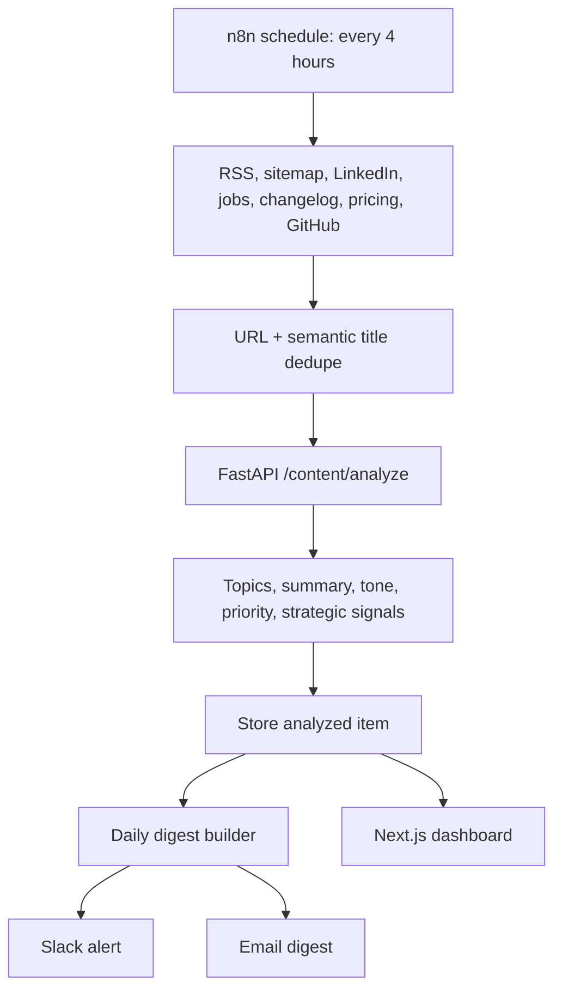

# Problem B: Competitor Content Monitoring

## Problem Statement

A B2B company wants to know within 24 hours when any of its top 10 competitors publishes a new blog, case study, or LinkedIn post. The automation monitors sources on a schedule, uses AI to summarize each new piece, and delivers a daily digest to Slack or email.

## My Interpretation

The valuable output is not a list of links. A useful competitor-monitoring system should decide which updates matter, detect strategic signals, and explain why a marketing or product team should care.

## Architecture

## Working Features

- Competitor registry with tracked keywords.
- Content ingestion for blogs, LinkedIn, press releases, case studies, pricing, jobs, changelogs, GitHub, YouTube, Reddit, and other sources.
- Topic classification for pricing, product launches, AI adoption, enterprise push, hiring, funding, partnerships, market expansion, customer proof, security, and positioning.
- Strategic signal detection for pricing changes, enterprise push, partnerships, hiring, market expansion, and narrative shifts.
- Deduplication using exact URL and fuzzy title matching.
- Priority score from 0 to 10.
- Daily digest with top developments, emerging themes, recommended actions, and low-confidence items.
- Operator dashboard showing KPIs, activity feed, topic heatmap, digest, and delivery channels.

## Tech Stack

| Layer | Tool |
| --- | --- |
| Orchestration | n8n schedule and HTTP nodes |
| Backend | FastAPI |
| Analysis | Python rules today; structured LLM summarization in production |
| Deduplication | RapidFuzz token similarity |
| Dashboard | Next.js, Tailwind, Recharts |
| Delivery | Slack or email integration surface |

## AI Pipeline

1. Fetch new content from configured competitor sources.
2. Normalize source, URL, title, body, author, and published date.
3. Deduplicate by URL and fuzzy semantic title similarity.
4. Classify topics and extract key points.
5. Generate summary, strategic signals, priority score, confidence, and recommended action.
6. Deliver only high-priority alerts immediately; batch the rest into the daily digest.

## Edge Cases

- LinkedIn pages may block scraping or change markup.
- Competitors may republish the same announcement across blog, press, and LinkedIn.
- A pricing-page change may be more important than a blog post even without a publication date.
- Low-confidence items should be included in the digest with a confidence warning.
- Empty days should send a brief "no major signal" digest rather than silence if the team expects daily delivery.

## Production Risks

- Scraping instability and anti-bot controls.
- API rate limits from search, LinkedIn, or third-party scraping providers.
- False positives from repeated keywords.
- LLM over-summarization that removes important competitive evidence.
- Slack fatigue if every update becomes an alert.

## Future Improvements

- Browser-based collectors with diffing for pricing and landing pages.
- Embedding-based competitor memory for stronger "strategic shift" detection.
- Human feedback on whether alerts were useful.
- CRM or sales enablement handoff when competitor signals affect active deals.
- Separate urgency thresholds by competitor and source type.
