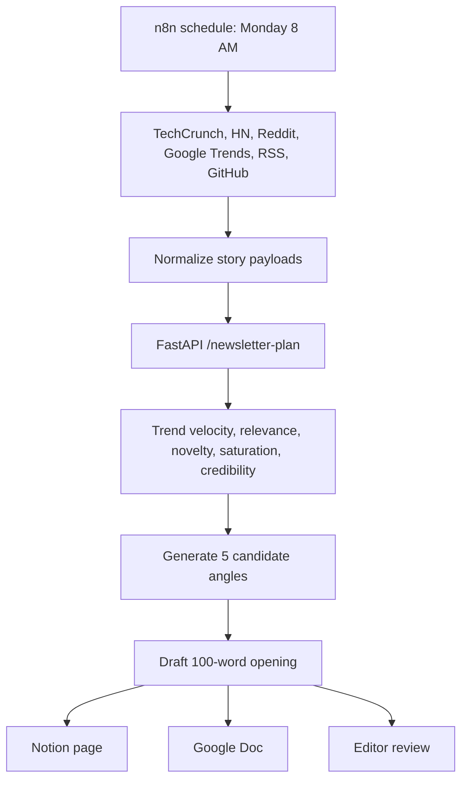

# Problem C: Newsletter Ideation Engine

## Problem Statement

A marketing newsletter writer needs to ship one issue per week. The automation runs every Monday morning, pulls trending stories from chosen sources, uses AI to filter and group them into themes, generates five candidate angles, and drafts the opening 100 words of the strongest one inside Notion or Google Docs.

## My Interpretation

The hard part is not generating ideas. The hard part is deciding which idea deserves attention this week. The system should help an editor reason about trend velocity, audience fit, novelty, saturation, credibility, and narrative framing.

## Architecture

## Working Features

- Story schema with source, URL, title, body, published date, engagement, and credibility.
- Audience profile schema with segments, interests, avoided topics, and tone.
- Editorial memory for detecting saturation and recently covered themes.
- Theme clustering across source stories.
- Scoring for trend velocity, audience relevance, novelty, saturation, and credibility.
- Narrative frames for optimistic, skeptical, founder, operator, and investor angles.
- Five candidate newsletter angles.
- Draft introduction for the highest-scoring angle.
- Export targets modeled for Notion and Google Docs.

## Tech Stack

| Layer | Tool |
| --- | --- |
| Orchestration | n8n weekly schedule |
| Backend | FastAPI |
| Editorial intelligence | Python pipeline with LLM-ready boundaries |
| Source memory | Local JSON for demo; pgvector or Chroma in production |
| Export | Notion or Google Docs integration surface |

## AI Pipeline

1. Collect trend stories from configured sources.
2. Deduplicate and normalize stories.
3. Group stories into themes using semantic similarity.
4. Score each theme for trend velocity, audience relevance, novelty, saturation, and credibility.
5. Generate narrative frames for different editorial perspectives.
6. Generate five candidate angles.
7. Draft the opening 100 words of the strongest angle with source IDs attached.

## Edge Cases

- A viral but low-credibility story should not dominate the issue.
- A topic covered last week should have lower novelty unless the new angle is meaningfully different.
- Thin stories should be filtered before drafting.
- Sources with conflicting claims should trigger review rather than confident synthesis.
- A Monday run with no useful trend data should return an empty grounded plan instead of fake ideas.

## Production Risks

- Trend APIs and social sources have rate limits.
- AI may create unsupported claims if prompts do not force source-grounded drafting.
- Repeated weekly themes can make the newsletter feel stale.
- Engagement metrics vary by source and should be normalized carefully.
- Export failures to Notion or Google Docs need retries and human visibility.

## Future Improvements

- Vector memory of previous issues.
- Reader engagement feedback loop.
- Editor preference learning.
- Multi-newsletter audience profiles.
- Source credibility model by domain and author.
- Automatic brief generation for subject lines, social posts, and repurposed threads.
